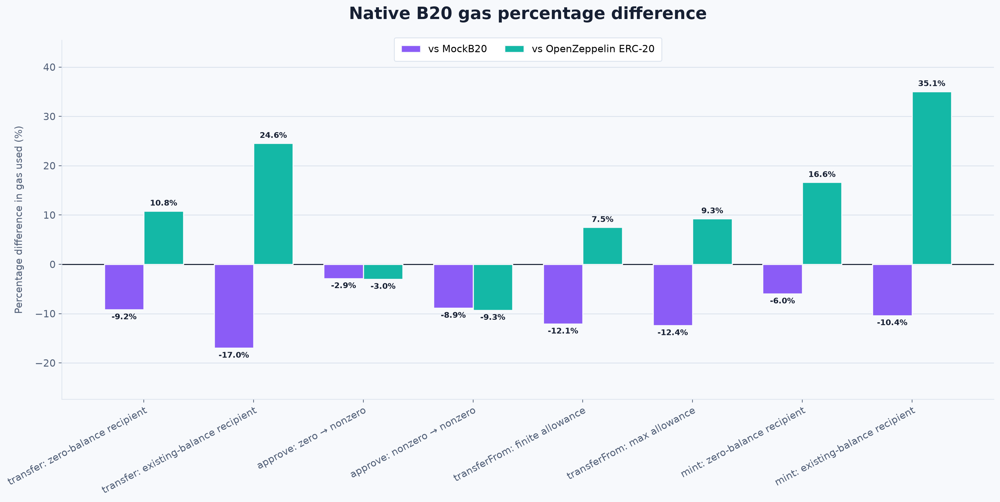
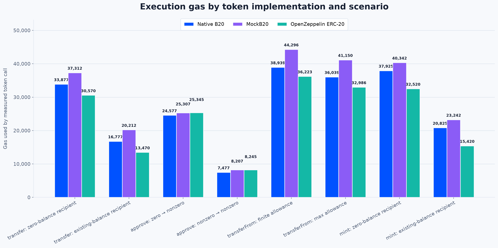

# Native B20 gas benchmark

This repository answers one question:

> How much execution gas does Native B20 use for common ERC-20 operations compared with Base's official Solidity MockB20 reference implementation and a conventional OpenZeppelin ERC-20?

It benchmarks `transfer`, `approve`, `transferFrom`, and `mint` under eight fixed storage-state scenarios. It does not benchmark deployment, token creation, optional B20 features, L1 data fees, or live-network costs.

## Results

All five repetitions within every implementation/scenario group were identical.

### Figure 1: Native B20 percentage difference



Negative percentages mean Native B20 used less gas under this methodology.

### Figure 2: absolute gas



<!-- BEGIN GENERATED RESULTS -->
| Scenario | Native B20 | MockB20 | OpenZeppelin ERC-20 |
|---|---:|---:|---:|
| transfer: zero-balance recipient | 33,877 | 37,312 | 30,570 |
| transfer: existing-balance recipient | 16,777 | 20,212 | 13,470 |
| approve: zero → nonzero | 24,577 | 25,307 | 25,345 |
| approve: nonzero → nonzero | 7,477 | 8,207 | 8,245 |
| transferFrom: finite allowance | 38,939 | 44,296 | 36,223 |
| transferFrom: max allowance | 36,039 | 41,150 | 32,986 |
| mint: zero-balance recipient | 37,925 | 40,342 | 32,520 |
| mint: existing-balance recipient | 20,825 | 23,242 | 15,420 |

| Scenario | Native vs MockB20 | Native vs OpenZeppelin |
|---|---:|---:|
| transfer: zero-balance recipient | -9.2% | +10.8% |
| transfer: existing-balance recipient | -17.0% | +24.6% |
| approve: zero → nonzero | -2.9% | -3.0% |
| approve: nonzero → nonzero | -8.9% | -9.3% |
| transferFrom: finite allowance | -12.1% | +7.5% |
| transferFrom: max allowance | -12.4% | +9.3% |
| mint: zero-balance recipient | -6.0% | +16.6% |
| mint: existing-balance recipient | -10.4% | +35.1% |
<!-- END GENERATED RESULTS -->

Raw and summarized data are available as [`raw.csv`](results/raw.csv), [`raw.json`](results/raw.json), and [`summary.csv`](results/summary.csv).

## Interpretation

Native B20 used less gas than MockB20 in every tested scenario, with gas reductions from 2.9% to 17.0%. That comparison is against Base's readable conformance implementation, not an optimized production Solidity token.

Against OpenZeppelin ERC-20, Native B20 used 3.0% less gas for zero-to-nonzero approval and 9.3% less for nonzero-to-nonzero approval. It used more gas for both transfer states, both transferFrom states, and both mint states—between 7.5% and 35.1% more in those six scenarios. B20 performs built-in checks and accounting that the smaller OpenZeppelin baseline does not provide, so this is not a feature-equivalent comparison.

Zero-to-nonzero balance and allowance writes cost substantially more than nonzero-to-nonzero writes across all implementations, as expected from EVM storage pricing. The percentages describe gas-accounting differences only; they are not claims about proportional CPU-time improvements.

## B20 and the three implementations

[B20](https://docs.base.org/base-chain/specs/upgrades/beryl/b20) is Base's native ERC-20 superset. It includes roles, supply caps, transfer policies, pausing, memos, permit, and variant-specific functionality. A B20 Asset is created through the singleton factory, but ordinary token calls use the familiar ERC-20 ABI.

- **Native B20:** B20 Asset functionality executed through Base's Rust precompiles. The benchmark uses Base Forge's in-process Base EVM, not a Solidity substitute.
- **MockB20:** Base's official Solidity reference or conformance implementation from [`base-std`](https://github.com/base/base-std/tree/4658f1b7b54ccc61b036adc32830594018ea507e). Its source explicitly describes it as “Solidity-as-if-Rust”: readability and correspondence with the Rust implementation take priority over Solidity gas optimization. It is not an optimized production Solidity token.
- **OpenZeppelin ERC-20:** OpenZeppelin Contracts v5.6.1 `ERC20`, wrapped with `Ownable` and a single `onlyOwner` mint method. It is a conventional baseline with fewer built-in features and is not fully feature-equivalent to B20.

The wrapper is intentionally small:

```solidity
contract BenchmarkERC20 is ERC20, Ownable {
    constructor(address initialOwner) ERC20("Benchmark Token", "BENCH") Ownable(initialOwner) {}

    function mint(address to, uint256 amount) external onlyOwner {
        _mint(to, amount);
    }
}
```

## Benchmark limitations and threats to validity

- MockB20 is not gas-optimized; it is a Solidity reference/conformance implementation.
- OpenZeppelin ERC-20 has fewer built-in features and is not feature-equivalent to B20.
- B20 token creation, Solidity deployment, and MockB20Factory creation gas are excluded.
- Base L1 data fees and transaction calldata fees outside the measured call are excluded.
- Gas is protocol-defined execution pricing, not a direct CPU benchmark; lower gas does not imply proportionally lower CPU time.
- Native B20 and MockB20 may run through different Foundry binaries in other workflows. This repository avoids that variable by using the same Base Forge binary with Base dispatch toggled; substituting stock Forge reintroduces it, and the included canary demonstrates a difference for this harness.
- Results apply only to the pinned software versions and compiler configuration.
- Storage values and warm/cold access state materially affect gas. This benchmark covers one explicit warm-account/cold-storage condition, not a matrix.
- The retained measurement wrapper overhead slightly influences absolute values and percentage ratios, although it is identical for corresponding function signatures.
- Local in-process Base Forge execution is not a live Base transaction and excludes networking, sequencing, and fee-market effects.
- The benchmark does not prove that B20 is cheaper for every operation, state transition, variant, or configuration.
- Optional B20 functionality—including permit, pause, custom policies, memos, batch operations, and multiplier changes—is intentionally out of scope.

## Preliminary tooling investigation

The [Base launch guide](https://docs.base.org/get-started/launch-b20-token) is correct that standard Forge cannot execute native B20 addresses: they are dispatched as Base precompiles and do not contain ordinary contract runtime bytecode. Local native execution requires Base's Foundry build with Base dispatch enabled.

`base-std`'s `BaseTest` selects its backend with a behavioral probe:

1. Before etching any code, it `STATICCALL`s `ActivationRegistry.admin()`.
2. A successful response with at least 32 bytes means live/native precompiles are present.
3. Otherwise it etches `MockB20Factory`, `MockPolicyRegistry`, and `MockActivationRegistry` at their canonical addresses and activates the mock feature gates.

An `EXTCODESIZE` check would be insufficient because native precompiles can respond while reporting no conventional runtime code. This benchmark additionally asserts the native `0xef` initialization markers and factory registration, or the exact MockB20/MockB20Factory runtime-code hashes, before accepting observations.

The official `MockB20Factory` requires Foundry cheatcodes. It uses `vm.etch` to install token runtime code and `vm.store` to initialize the same storage layout mirrored by the Rust implementation. It is test infrastructure and is not deployable production code.

### Commands used for each mode

The Base installer creates a `base-forge` wrapper that forces `FOUNDRY_BASE=true`. To remove the binary itself as a comparison variable, final measurements use its underlying pinned binary for all three implementations:

```bash
# Native B20
FOUNDRY_BASE=true ~/.foundry/versions/base-v1.1.0/forge test

# MockB20 reference mode
FOUNDRY_BASE=false ~/.foundry/versions/base-v1.1.0/forge test

# OpenZeppelin Solidity mode
FOUNDRY_BASE=false ~/.foundry/versions/base-v1.1.0/forge test
```

The repository scripts add the exact test filters, mode expectations, five repetitions, and `--offline` flag.

### Standard Forge compatibility check

A fixed OpenZeppelin transfer canary was executed with the pinned standard Forge and with Base Forge in non-Base mode. Standard Forge reported **27,707** gas and Base Forge reported **30,507** gas for that harness call. They are therefore not treated as interchangeable measurement environments here. This canary is a scoped observation, not a proof about every EVM execution path.

All published three-way results below come from the same Base Forge binary. The machine-readable canary result is in [`results/tooling-canary.json`](results/tooling-canary.json).

## Scenarios and exact state

All tokens use name `Benchmark Token`, symbol `BENCH`, and 18 decimals. B20 uses the Asset variant with default transfer and mint policies, the default multiplier, default supply cap, no paused features, and only the mint role needed by the benchmark.

| Constant | Value |
|---|---:|
| Initial total supply | `1,000,000e18` |
| Transfer, transferFrom, and mint amount | `100e18` |
| Existing recipient balance | `1,000e18` |
| Finite/nonzero initial allowance | `1,000e18` |
| New approved allowance | `2,000e18` |
| Remaining finite allowance | `900e18` |

Actors are fixed across implementations:

| Role | Address |
|---|---|
| B20 admin + minter / OpenZeppelin owner | `0x00000000000000000000000000000000000a11ce` |
| Holder / allowance owner | `0x0000000000000000000000000000000000000b0b` |
| Spender | `0x0000000000000000000000000000000000005eed` |
| Recipient | `0x000000000000000000000000000000000000cafe` |
| B20 factory caller | `0x0000000000000000000000000000000000facade` |

The B20 factory salt is `keccak256("b20-gas-benchmark-v1")`. Native B20 and MockB20 consequently use the same deterministic token address. The OpenZeppelin contract necessarily has a conventional deployment address.

The eight scenarios are:

1. `transfer`: recipient balance is zero.
2. `transfer`: recipient balance is `1,000e18`.
3. `approve`: allowance changes from zero to `2,000e18`.
4. `approve`: allowance changes from `1,000e18` to `2,000e18`.
5. `transferFrom`: a `1,000e18` finite allowance is reduced by `100e18`.
6. `transferFrom`: a `type(uint256).max` allowance is preserved.
7. `mint`: recipient balance is zero.
8. `mint`: recipient balance is `1,000e18`.

The pinned Native B20, MockB20, and OpenZeppelin implementations all preserve maximum allowance, so scenario 6 is semantically comparable. Total supply is `1,000,000e18` before every scenario; when the recipient begins nonzero, that balance is allocated from the holder rather than added to supply.

## Measurement methodology

The primary value is captured around only the target call:

```solidity
uint256 gasBefore = gasleft();
bool success = token.transfer(recipient, amount);
uint256 gasUsed = gasBefore - gasleft();
```

Mint uses the same boundary without a return value. The measurement includes the token's required `Transfer`/`Approval` log and a small identical external-call boundary: ABI encoding, `CALL`, return handling where applicable, and the second `gasleft()`. That overhead is retained rather than estimated and subtracted. Setup, deployment, factory creation, state normalization, correctness assertions, event expectations, logging, and result serialization occur outside the boundary.

Each repetition is a fresh Foundry test execution with a newly initialized token. The scripts run the eight gas tests five separate times with `BENCHMARK_RUN=1..5`; calls are never chained against mutated benchmark state.

Immediately before timing, the harness:

- cools the token account and all token storage previously loaded during setup;
- accesses token code to warm the target account without warming token storage;
- warms the caller, holder, spender, and recipient EOA accounts through balance reads;
- warms the Policy Registry account for B20 while leaving its storage cold.

Thus the target token address and involved accounts are warm, while balance, allowance, role, policy, supply, pause, and supply-cap storage touched by the call begins cold. Recipient and sender EOA account warmth does not itself warm their entries in the token's mappings. The chosen finite allowance and sender balances remain nonzero, so none of these measured scenarios relies on a storage-clearing refund.

Every call prints a line such as:

```text
BENCHMARK,implementation=native_b20,operation=transfer,scenario=recipient_zero,run=1,gas_used=33877
```

The validator rejects missing rows, duplicate run identifiers, nonpositive gas, unverified modes, missing versions, or any variation among the five repetitions.

## Correctness gate

Correctness tests are separate from gas tests and run before collection. They verify:

- transfer balance changes, unchanged total supply, boolean return, and `Transfer` event;
- approve allowance replacement, boolean return, and `Approval` event;
- transferFrom balances, unchanged total supply, finite/max allowance behavior, boolean return, and `Transfer` event;
- mint balance and supply changes, zero-address `Transfer` event, and caller authorization.

The same B20 correctness contract runs once against native Rust precompiles and once against the official Solidity mocks. Graph generation depends on strict result validation, so failed correctness or mode tests prevent new figures.

## Pinned versions

| Dependency | Pin |
|---|---|
| `base/base-std` | `4658f1b7b54ccc61b036adc32830594018ea507e` |
| Base Forge / Base Anvil release | `v1.1.0` |
| Base Forge commit | `6130ccf6af0b3399777aee3876486e2ba9ebb38f` |
| Embedded Base Rust precompiles | `a3c3011b16dae73aaea455ec0a5ff614e65b7d0a` |
| Standard Foundry | `1.4.1-stable`, `cf7746048646f2ecff48246dd61e265e49ab16f0` |
| forge-std | `620536fa5277db4e3fd46772d5cbc1ea0696fb43` |
| OpenZeppelin Contracts | `v5.6.1`, `5fd1781b1454fd1ef8e722282f86f9293cacf256` |
| Solidity | `0.8.30` |
| Optimizer | enabled, 200 runs |
| `via_ir` | `false` |
| EVM version | `osaka` |
| Python | `3.13.12` |
| Matplotlib | `3.11.0` |

All plotting transitive dependencies are pinned in [`requirements.lock`](requirements.lock). These results were produced on macOS 26.3, Darwin 25.3.0, arm64. Gas values are deterministic protocol accounting and should not depend on host CPU speed.

## Reproduction

Install the pinned toolchains:

```bash
base-foundryup --install v1.1.0
foundryup --install v1.4.1
python3.13 --version  # must report 3.13.12 for exact metadata reproduction
```

Fetch exact Solidity dependencies and run the workflow:

```bash
make deps
make test
make benchmark
make plots
make all
```

- `make test` verifies pins, runs correctness in all modes, records the standard/Base Forge canary, and validates the committed dataset.
- `make benchmark` reruns correctness, collects all 120 observations, validates them, and writes the summary.
- `make plots` recreates the summary, both figures, and these generated result tables.
- `make all` performs correctness → collection → validation → summary → figures.

If native execution fails, the runner still attempts MockB20 and OpenZeppelin collection, leaves Native B20 observations absent, fails strict validation, and does not generate comparative figures or claims.

## References

- [Launch a B20 Token](https://docs.base.org/get-started/launch-b20-token)
- [B20 Native Token Standard / Beryl specification](https://docs.base.org/base-chain/specs/upgrades/beryl/b20)
- [`base-std` B20 documentation](https://github.com/base/base-std/tree/4658f1b7b54ccc61b036adc32830594018ea507e/docs/B20)
- [`base-std` B20 interfaces, mocks, libraries, and tests](https://github.com/base/base-std/tree/4658f1b7b54ccc61b036adc32830594018ea507e)
